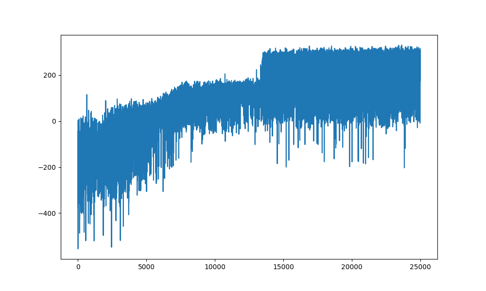

# LunarLander with REINFORCE Algorithm

This project demonstrates the application of the REINFORCE algorithm, a policy gradient method, to solve the LunarLander-v2 environment using reinforcement learning.

## Project Overview

The LunarLander-v2 environment challenges an agent to control a lander, stabilizing its descent and landing it successfully on a designated pad. The agent receives positive rewards for stable landings and penalties for crashes or unstable maneuvers.

Key highlights:
- **Environment:** Gymnasium's LunarLander-v2
- **Algorithm:** REINFORCE, a policy gradient method
- **Neural Network:** Fully connected network with Haiku
- **Optimizer:** Adam optimizer with learning rate adjustments
- **Training Duration:** 5,000+ episodes

---

## Implementation Details

### Environment Setup
- **Observation Space:** 8-dimensional vector representing lander's position, velocity, and orientation.
- **Action Space:** Discrete, with 4 possible actions (fire main engine, fire left engine, fire right engine, no action).

### Key Components
1. **Policy Network:** A neural network approximates the policy, taking the observation as input and outputting logits for each action.
2. **Returns Calculation:** Computes discounted returns for each step in an episode.
3. **Policy Gradient Loss:** Implements the REINFORCE update rule using the log-probabilities of actions weighted by their returns.
4. **Optimization:** Uses Adam to update the neural network parameters.

### Training Loop
The agent was trained for 5,000+ episodes with the following features:
- Batch size of 128 for training updates.
- Logits converted to probabilities using softmax.
- JAX and Haiku libraries for efficient computation.

---

## Results

- The agent initially struggled with highly negative rewards but showed improvement as training progressed.
- Final performance demonstrates the agent's ability to land the spacecraft with moderate stability.



---

## Repository Structure

- `src/`: Contains the main Python scripts for training and evaluation.
- `visuals/`: Includes plots of training performance and other visualizations.
- `requirements.txt`: Dependencies for the project.

---

## How to Use

### Installation
1. Clone the repository.
2. Install dependencies:
   ```bash
   pip install -r requirements.txt
   ```

### Running the Training
Execute the main script to train the agent:
```bash
python src/train_lunarlander.py
```

### Visualizing Results
Plots and videos are saved in the `visuals/` directory. Use the provided scripts to visualize trained policies.

### final Policy
(visuals/LunarLander-REINFORCE_policy.mp4)
---

## Acknowledgments
This implementation is based on the coursework from the African Institute for Mathematical Sciences (AIMS) and the Deep Learning Indaba 2022. The project uses tools from libraries like Gymnasium, JAX, Haiku, and Optax.
